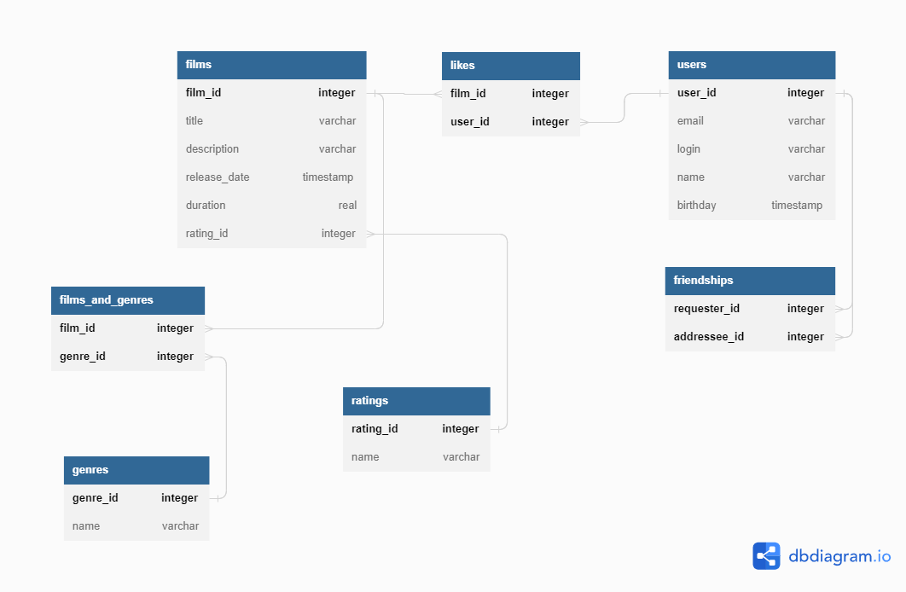

# java-filmorate
Filmorate app is a film-based social network where users can rate and view ratings of films.

# Stack
- Java-11
- Spring Boot
- JDBC
- H2
- Maven
- REST
- Lombok

# Functionality
- Users: adding, editing, viewing, adding and removing friends, viewing common friends;
- Films: adding, editing, adding and removing a like, getting most liked films

# Requirements
- Java 11

# Developer
[Olga Obraztsova](https://github.com/olgaobraztsova)

